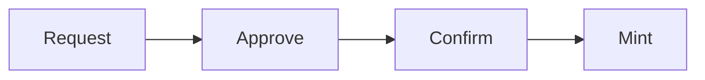
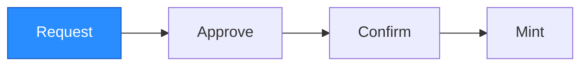
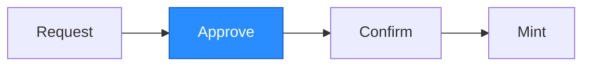
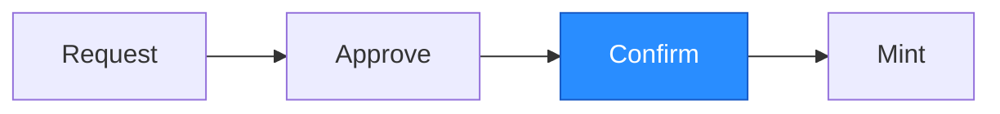
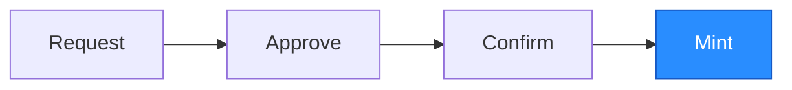

A deposit moves BTC from a user's Bitcoin wallet into the Hashi-managed UTXO
pool, minting a corresponding amount of `hBTC` into the user's account on Sui.
The process has four phases:



The split between **Approve** and **Confirm** introduces a configurable
time-delay window (see
[`bitcoin_deposit_time_delay_ms`](/config#bitcoin_deposit_time_delay_ms))
between the moment the committee certifies a deposit and the moment funds are
minted. This delay gives operators a chance to detect a faulty or fraudulent
approval and pause the service before any `hBTC` is minted.

## Request



The user creates a Bitcoin transaction that sends BTC to a Hashi deposit
address. Each deposit address is a unique Taproot address derived from the
target destination address on Sui (see [Bitcoin Address Scheme](/address-scheme)).
The deposit must meet the dust minimum (`546 sats`) to avoid creating
unspendable UTXOs on Bitcoin.

After the Bitcoin transaction is broadcast, the user notifies Hashi by
constructing a `DepositRequest` and calling `hashi::deposit::deposit` on Sui.

First, the user creates the request by calling `hashi::deposit_queue::deposit_request`:

```move
public fun deposit_request(
    utxo: Utxo,
    clock: &Clock,
    ctx: &mut TxContext,
): DepositRequest
```

The `Utxo` is constructed from the Bitcoin transaction details:

```move
public fun utxo(
    utxo_id: UtxoId,
    amount: u64,
    derivation_path: Option<address>,
): Utxo

public fun utxo_id(
    txid: address,
    vout: u32,
): UtxoId
```

- `txid`: the 32-byte Bitcoin transaction hash.
- `vout`: the output index within that transaction.
- `amount`: the deposit amount in satoshis.
- `derivation_path`: the Sui address used to derive the deposit address.

The user then submits the request:

```move
public fun deposit(
    hashi: &mut Hashi,
    utxo: Utxo,
    clock: &Clock,
    ctx: &mut TxContext,
)
```

The function validates that the deposit meets the minimum amount and the UTXO
has not been previously deposited. The request is then placed in the deposit
queue, and committee members start monitoring Bitcoin for confirmation.


## Approve



Committee members monitor the Bitcoin network for the deposit transaction. The
transaction must reach a sufficient number of block confirmations (see
[`bitcoin_confirmation_threshold`](/config#bitcoin_confirmation_threshold))
before it is considered final. This guards against chain reorganizations where
a confirmed transaction could be reversed. If the transaction is never
confirmed or is invalidated by a reorg, the deposit is ignored.

After confirmation, each committee member independently screens the deposit's
source address by making a request to its configured sanctions-checking
endpoint (see [Handling Sanctioned Addresses](/sanctions)). A member
that considers the address sanctioned does not vote to approve the deposit.

After a node determines that a deposit request is both confirmed on Bitcoin
and passes its own screening checks, it communicates with the other members
of the Hashi committee and collects signatures from validators that agree the
deposit should be approved. If a quorum of validators cannot agree that a
deposit should be approved, the request is either retried later or ignored
if invalid.

After a quorum is reached, one validator submits the certificate onchain by
calling `hashi::deposit::approve_deposit`:

```move
entry fun approve_deposit(
    hashi: &mut Hashi,
    request_id: address,
    cert: CommitteeSignature,
    clock: &Clock,
    ctx: &mut TxContext,
)
```

The function verifies the committee certificate against the current committee
and records both the certificate and the current clock timestamp on the
request. The request remains in the deposit queue, and no `hBTC` is minted yet.

## Confirm



After approval, the deposit must wait through the configured time-delay
window (see
[`bitcoin_deposit_time_delay_ms`](/config#bitcoin_deposit_time_delay_ms))
before it can be confirmed. The window gives operators a chance to detect a
faulty or fraudulent approval and pause the service before funds are minted.
While the service is paused, `confirm_deposit` is rejected, so any pending
approvals stay parked in the queue until the system is unpaused or the
committee rotates and the deposit is re-approved.

If the committee rotates during the delay window, the existing approval
becomes invalid and the deposit must be re-approved by the new committee. The
onchain `confirm_deposit` re-verifies the stored certificate against the
current committee, not the committee that originally approved it.

After the delay has elapsed, any caller may call `hashi::deposit::confirm_deposit`:

```move
entry fun confirm_deposit(
    hashi: &mut Hashi,
    request_id: address,
    clock: &Clock,
    ctx: &mut TxContext,
)
```

The function:

1. Re-verifies the stored committee certificate against the current committee.
2. Asserts that `approval_timestamp_ms + bitcoin_deposit_time_delay_ms <= now`.
3. Aborts if the request was never approved, the certificate no longer
   verifies, or the delay has not elapsed.

## Mint



After both checks in `confirm_deposit` pass, the function mints the
corresponding amount of `hBTC` and sends it to the user's Sui address. The
deposited UTXO is added to the Hashi-managed UTXO pool, making it available
for future withdrawal coin selection.
