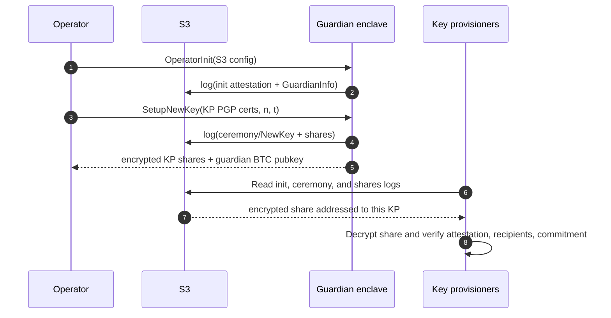
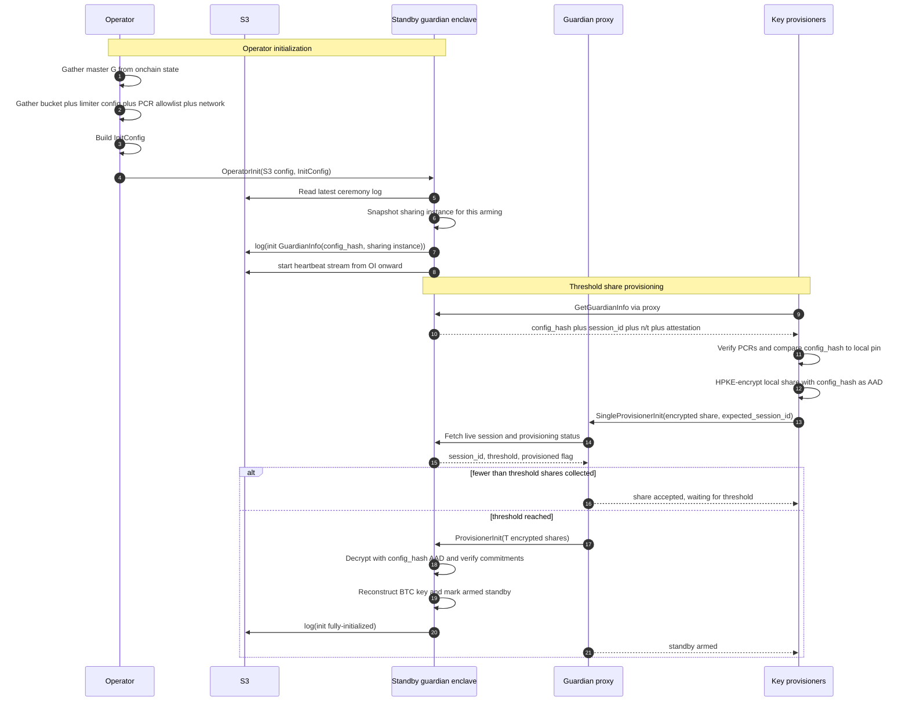
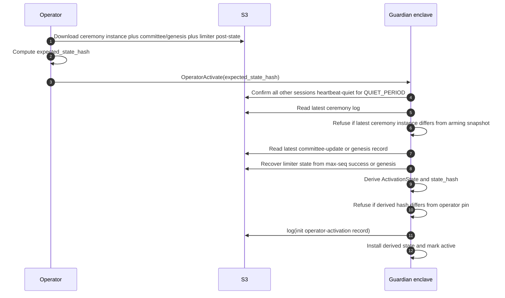
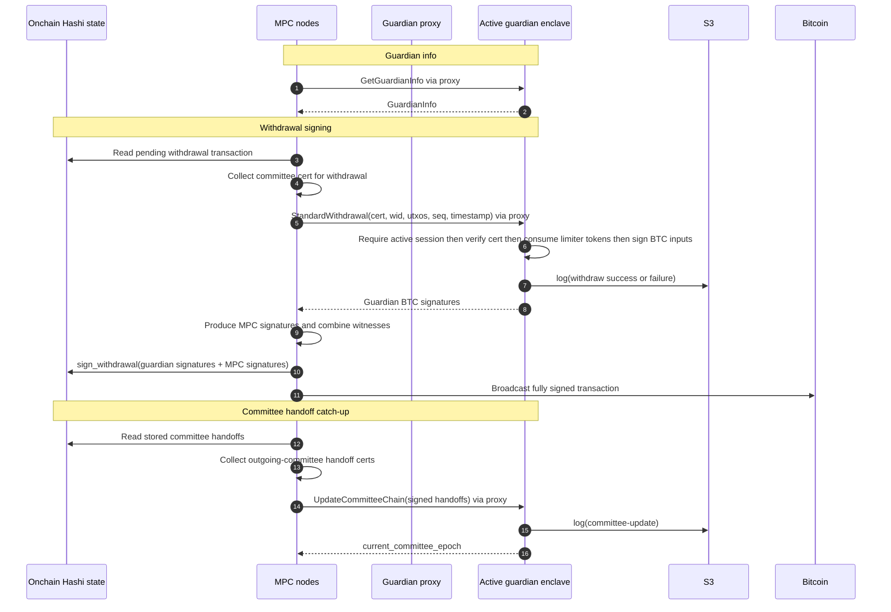

To protect against vulnerabilities and against malicious past committees,
Hashi uses a withdrawal guardian: a second signatory on the managed Bitcoin
deposits. All deposits are spendable only with a 2-of-2 multisig where the
guardian is one party and the Hashi MPC committee is the other.

## Components

The guardian integration has four distinct flows:

- **Ceremony mode** is the key-generation control-plane flow. The operator
  initializes a ceremony guardian, supplies the KP roster, and receives the
  guardian BTC public key plus encrypted KP shares.
- **Withdraw-mode provisioning** arms a standby withdrawal guardian while the
  current active guardian is still alive. The operator installs a stable
  `InitConfig`; each KP independently recomputes `config_hash` from its locally
  configured limiter config, PCR allowlist, and network plus the onchain master
  key, requires it to match the enclave's, and submits threshold encrypted shares
  through the public relay.
- **Activation** is the operator-triggered takeover step. The standby enclave
  confirms a quiet window, derives live state from S3, checks the operator's
  expected state hash, records activation, and only then serves withdrawals.
- **Normal operation** is a data-plane flow. MPC nodes call the public guardian
  proxy for guardian info, withdrawal signatures, and committee handoff updates.

The main components are:

- **MPC nodes**: the Hashi validator committee. Nodes collect committee
  certificates, run the MPC signer, and call the guardian for the second
  Bitcoin signature.
- **Guardian proxy**: the public gRPC endpoint. It forwards node-facing
  guardian RPCs and relays key-provisioner shares.
- **Guardian enclave**: the private signer and policy engine. A standby
  guardian stores static config and the reconstructed BTC key; an active
  guardian additionally verifies committee certificates, enforces the limiter,
  signs Bitcoin inputs, and records signed logs.
- **Key provisioners (KPs)**: independent holders of encrypted guardian key
  shares.
- **Operator**: the off-enclave actor that drives guardian ceremony and
  withdraw-mode provisioning and activation.
- **S3**: immutable log storage for attestation,
  ceremony, share recovery, heartbeat, genesis, withdrawal, and committee-update
  logs. Activation records are session lifecycle records in the activating
  session's init log.
- **Onchain Hashi state**: the source of committee, config, withdrawal, and MPC
  key state used by nodes and initialization tooling.

## Ceremony mode flow

## Withdraw-mode provisioning flow

First deploy also has a genesis bootstrap path not shown above: if the operator
finds no `committee-update/` or `genesis/` record in S3, it reads the current
committee from onchain state and calls the guardian's `OperatorWriteGenesis` RPC
after `OperatorInit`. The enclave logs the operator-supplied committee to
`genesis/` as-is; it is operator-trusted and used on first deploy only. Later
deploys skip this step.

## Standby activation flow

## Normal operation flow

