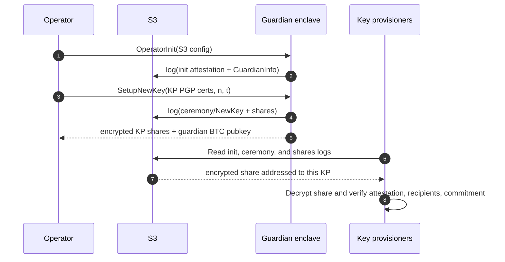
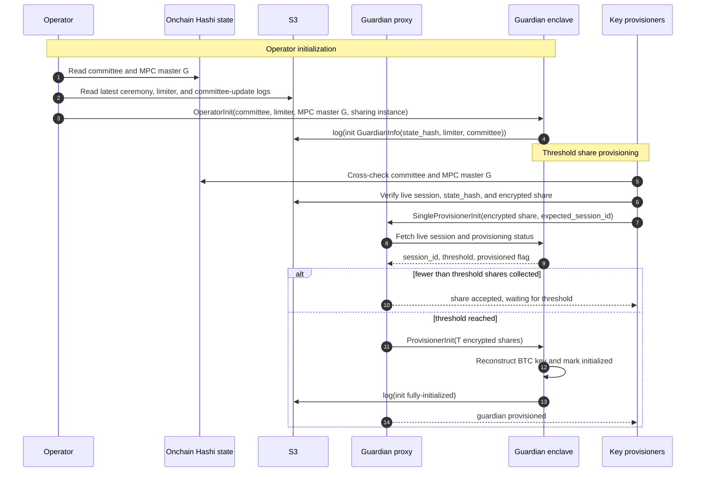
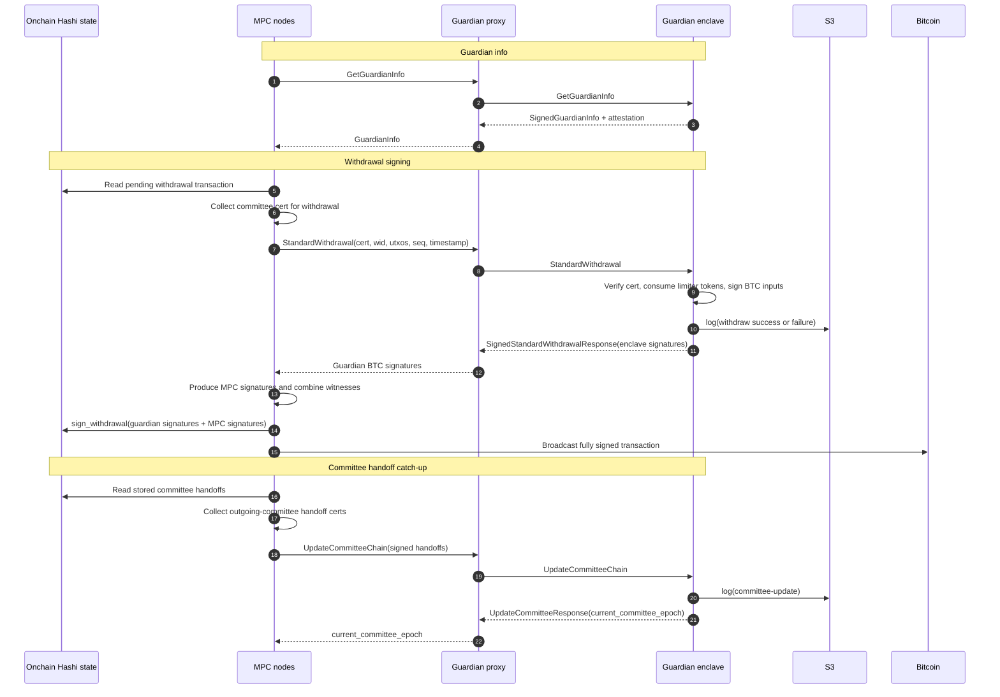

To protect against vulnerabilities and against malicious past committees,
Hashi uses a withdrawal guardian: a second signatory on the managed Bitcoin
deposits. All deposits are spendable only with a 2-of-2 multisig where the
guardian is one party and the Hashi MPC committee is the other.

## Components

The guardian integration has three distinct flows:

- **Ceremony mode** is the key-generation control-plane flow. The operator
  initializes a ceremony guardian, supplies the KP roster, and receives the
  guardian BTC public key plus encrypted KP shares.
- **Withdraw-mode provisioning** initializes the live withdrawal guardian. The
  operator installs the verified state, and KPs submit threshold encrypted
  shares through the public relay.
- **Normal operation** is a data-plane flow. MPC nodes call the public guardian
  proxy for guardian info, withdrawal signatures, and committee handoff updates.

The main components are:

- **MPC nodes**: the Hashi validator committee. Nodes collect committee
  certificates, run the MPC signer, and call the guardian for the second
  Bitcoin signature.
- **Guardian proxy**: the public gRPC endpoint. It forwards node-facing
  guardian RPCs and relays key-provisioner shares.
- **Guardian enclave**: the private signer and policy engine. It verifies
  committee certificates, enforces the limiter, signs Bitcoin inputs, and
  records signed logs.
- **Key provisioners (KPs)**: independent holders of encrypted guardian key
  shares.
- **Operator**: the off-enclave actor that drives guardian ceremony and
  withdraw-mode provisioning.
- **S3**: immutable log storage for attestation,
  ceremony, share recovery, heartbeat, withdrawal, and committee-update logs.
- **Onchain Hashi state**: the source of committee, config, withdrawal, and MPC
  key state used by nodes and initialization tooling.

## Ceremony Mode Flow

## Withdraw-Mode Provisioning Flow

## Normal Operation Flow

