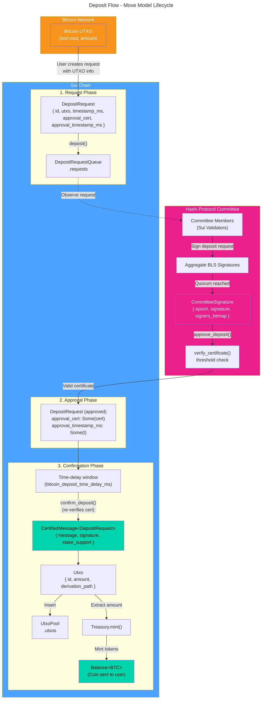
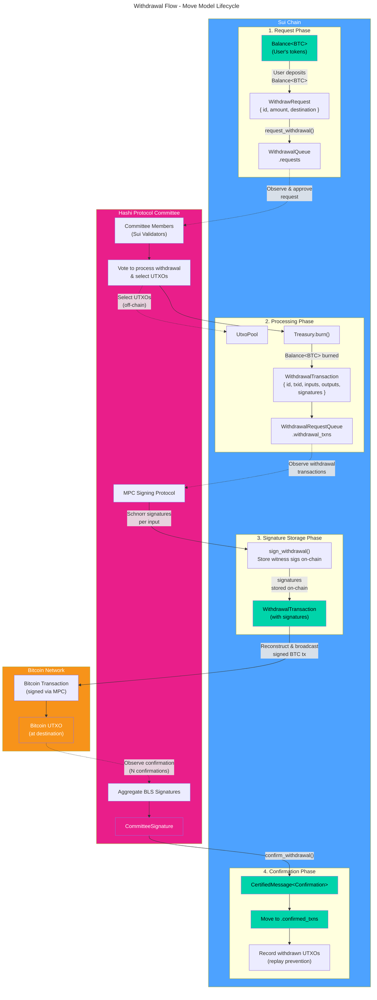

This document illustrates the lifecycle of key Move models in the deposit and
withdrawal flows, showing how data structures transform between onchain (Sui)
and offchain (Bitcoin) states.

## Deposit flow

### Deposit flow summary

| Step | Action                                     | Model Transformation                                                                  |
| ---- | ------------------------------------------ | ------------------------------------------------------------------------------------- |
| 1    | User sends BTC to bridge address           | Bitcoin UTXO created                                                                  |
| 2    | User calls `deposit()`                     | `DepositRequest` → `DepositRequestQueue`                                              |
| 3    | Committee members observe and sign request | BLS signatures aggregated → `CommitteeSignature`                                      |
| 4    | Leader calls `approve_deposit()` with cert | `verify_certificate()` → request stores `approval_cert` and `approval_timestamp_ms`   |
| 5    | Time-delay window elapses                  | `bitcoin_deposit_time_delay_ms` (allows committee rotation if approval is fraudulent) |
| 6    | Anyone calls `confirm_deposit()`           | Re-`verify_certificate()` → `CertifiedMessage<DepositRequest>`                        |
| 7    | Certified request processed                | `DepositRequest` → `Utxo` in `UtxoPool`                                               |
| 8    | Treasury mints tokens                      | `Utxo.amount` → `Balance<BTC>` to user                                                |

---

## Withdrawal flow

:::info

The Bitcoin confirmation threshold is stored onchain in the config key
`bitcoin_confirmation_threshold` (default `6`). Witness signatures are stored
onchain so that any leader can reconstruct and re-broadcast the signed
Bitcoin transaction without MPC re-signing (for example, after leader
rotation or mempool eviction).

:::

### Withdrawal flow summary

| Step | Action                                       | Model Transformation                                                        |
| ---- | -------------------------------------------- | --------------------------------------------------------------------------- |
| 1    | User requests withdrawal                     | `Balance<BTC>` → `WithdrawalRequest` → `WithdrawalRequestQueue.requests`    |
| 2    | Committee approves request                   | `WithdrawalRequest` status → `Approved`                                     |
| 3    | Leader commits withdrawal tx                 | `Balance<BTC>` burned, `WithdrawalTransaction` created in `.withdrawal_txns`|
| 4    | MPC protocol signs Bitcoin transaction       | Committee collectively signs via MPC using selected UTXOs                   |
| 5    | Leader stores witness signatures on-chain    | `sign_withdrawal()` → `WithdrawalTransaction` updated with signatures       |
| 6    | BTC transaction broadcast (and re-broadcast) | Signed tx reconstructed from on-chain data, broadcast to Bitcoin            |
| 7    | Committee signs confirmation certificate     | `CommitteeSignature` created after BTC tx confirmed                         |
| 8    | Leader confirms withdrawal                   | `WithdrawalTransaction` moved to `.confirmed_txns`, UTXOs marked spent      |

---

## Key models reference

| Model                    | Location                                 | Description                                                            |
| ------------------------ | ---------------------------------------- | ---------------------------------------------------------------------- |
| `Balance<BTC>`           | User wallet                              | Wrapped BTC token on Sui                                               |
| `DepositRequest`         | `DepositRequestQueue`                    | Pending deposit awaiting committee confirmation                        |
| `Utxo`                   | `UtxoPool`                               | Onchain representation of a Bitcoin UTXO                               |
| `WithdrawalRequest`      | `WithdrawalRequestQueue.requests`        | User's withdrawal request with destination and lifecycle status        |
| `WithdrawalTransaction`  | `WithdrawalRequestQueue.withdrawal_txns` | In-flight withdrawal tx, stores inputs, outputs, and witness signatures|
| `WithdrawalTransaction`  | `WithdrawalRequestQueue.confirmed_txns`  | Confirmed withdrawal tx (historical record)                            |
| `Bitcoin UTXO`           | Bitcoin Network                          | Actual unspent transaction output on Bitcoin                           |
| `Committee`              | `CommitteeSet`                           | BLS signing committee of Sui validators for an epoch                   |
| `CommitteeMember`        | `Committee.members`                      | Validator with public_key and voting weight                            |
| `CommitteeSignature`     | Transaction input                        | Aggregated BLS signature with signers bitmap                           |
| `CertifiedMessage<T>`    | Verified onchain                         | Message proven to have committee quorum support                        |
