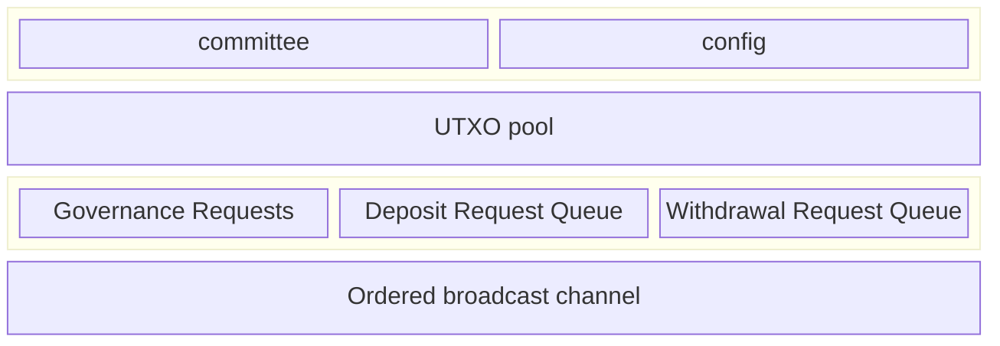

Every committee member is responsible for running a Hashi node service. Each
Hashi node exposes an HTTP service, secured by Transport Layer Security (TLS)
using a self-signed cert (the ed25519 public key is available in the Hashi
System State object), and serves a gRPC `HashiService`.

## Sui contracts

- The Hashi Move packages are published as normal packages. The Hashi packages
  are not system packages, and are not part of the Sui framework.

## Stateless

A main goal of this design is to make the Hashi service as stateless as
possible. Outside of any cryptographic material required for participating in
the protocol, any state critical for the functioning of the service must be
stored on Sui as part of the live object set. Knowledge of any historical
transactions or events previously emitted must not be needed for correct
operation of the service.

The set of data structures and state kept onchain is as follows:

## Emergency pause and unpause

The bridge supports an emergency pause mechanism that allows committee members
to halt bridge operations when they detect anomalous or potentially malicious
activity. This mechanism is part of the governance requests shown in the
onchain state diagram above.

The quorum thresholds for pause and unpause operations are intentionally
asymmetric:

- **Emergency pause threshold:** 5% (500 bps) of committee voting power. This
  threshold is intentionally low so that even a small number of committee
  members can rapidly halt bridge operations in response to an emergency.
- **Unpause threshold:** 66.67% of committee voting power. This threshold is
  intentionally high to ensure broad consensus among committee members before
  resuming bridge operations.

When enough committee members signal a pause to meet the emergency pause
quorum, the bridge halts processing of deposits and withdrawals. Resuming
operations requires a supermajority of committee voting power to signal an
unpause, providing a strong safeguard against premature resumption.