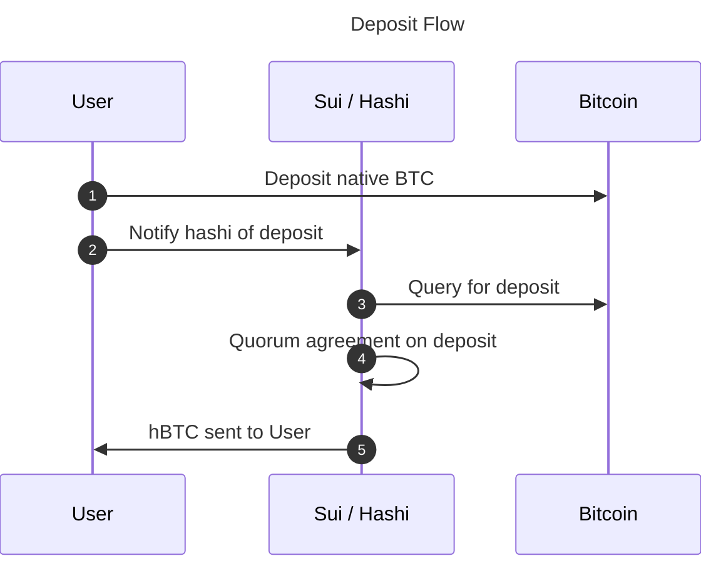
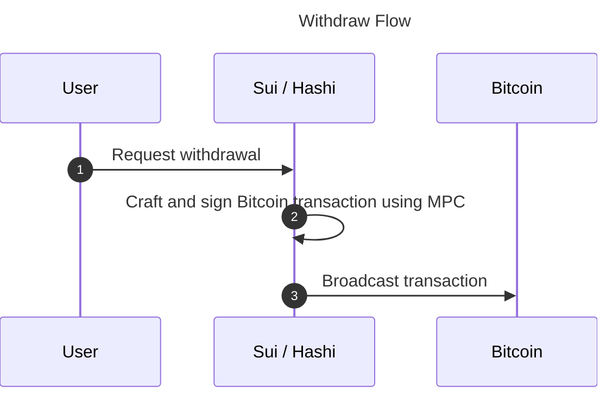

There are two main user flows for interacting with `hashi`: deposits and
withdrawals.

:::info
The only coin the Hashi protocol creates is `hBTC`, the Bitcoin-backed asset it
mints on deposit. There is no `$HASHI` token: Hashi has no governance, utility,
or airdrop token, and committee members govern the protocol by voting onchain
with their validator stake weight. Treat any `$HASHI` token offering, presale,
or airdrop as an imitation.
:::

## Deposit flow

To use `BTC` on Sui (for example, as collateral for a loan), you must
deposit your `BTC` to a Hashi MPC-controlled Bitcoin address.

<div style={{zoom: 1.5}}>



</div>

### BTC deposit address

Every Sui address has its own unique Hashi Bitcoin deposit address. See
[Bitcoin Address Scheme](address-scheme.mdx) for the full derivation
details.

### Deposit

After your deposit address is determined, you can initiate a deposit to
Hashi.

1. Broadcast a Bitcoin transaction depositing `BTC` into your unique deposit
   address.
1. Notify Hashi of the deposit by submitting a transaction to Sui that
   includes the deposit transaction ID.
1. Hashi nodes query Bitcoin and watch for confirmation of the deposit
   transaction.
1. Hashi nodes communicate, waiting until a quorum has confirmed the deposit
   (after X block confirmations).
1. Hashi confirms the deposit onchain, minting the equivalent amount of
   `hBTC` and transferring it to your Sui address. You can then immediately
   use the `hBTC` to interact with a DeFi protocol. For example, you can use
   the `hBTC` as collateral for a loan in `USDC`.

For a detailed breakdown of each phase, see [Deposit](deposit.mdx).

### Running a test deposit on Testnet

Hashi's Testnet deployment uses **Bitcoin Signet**, so a test deposit needs Signet BTC. Signet coins have no value, and you cannot buy or mine them in any practical sense; you get them from a faucet.

:::caution
The Signet faucets below are **third-party services, not operated or verified by the Hashi team**. Availability, rate limits, and URLs change without notice, and this page makes no guarantee that any of them work at the time you read it. Never send real BTC to a Signet faucet or a Signet address.
:::

Commonly used public faucets for the default Signet network include [signetfaucet.com](https://signetfaucet.com/) and its alternate at [alt.signetfaucet.com](https://alt.signetfaucet.com/). Confirm that a faucet serves **default Signet** before using it. Some communities run custom signets whose coins are not valid on the network Hashi's Testnet uses.

:::info
Your own Signet node cannot create spendable coins for you. A central authority signs Signet blocks, so a faucet is the normal way to get test BTC.
:::

Once you hold Signet BTC, run the deposit loop described above through the CLI. Global options attach to the first-level subcommand, so `-c` goes after `deposit` (see the [CLI reference](node-operator-runbook.mdx#61-global-options)):

```bash
# 1. Get the deposit address derived from your Sui address
hashi deposit -c hashi-cli.toml generate-address --recipient 0x<sui-address>

# 2. Send Signet BTC to that address from your wallet or the faucet,
#    then note the resulting Bitcoin txid.

# 3. Notify Hashi of the deposit
hashi deposit -c hashi-cli.toml request --txid <btc-txid> --recipient 0x<sui-address>

# 4. Track it until hBTC is minted
hashi deposit -c hashi-cli.toml status <request-id>
hashi balance -c hashi-cli.toml 0x<sui-address>
```

The deposit must meet Bitcoin's dust minimum, and Hashi waits for a confirmation threshold before minting, so expect to wait for several Signet blocks between steps 3 and 4. See [Deposit](deposit.mdx) for the request, approve, confirm, and mint phases in detail.

## Withdraw flow

After you decide you want your `BTC` back on Bitcoin (for example, after you
pay off your loan), you can initiate a withdrawal.

<div style={{zoom: 1.5}}>



</div>

### Withdraw

1. You send a transaction to Sui with the amount of `hBTC` you want to
   withdraw and the Bitcoin address you want to withdraw to.
1. Hashi picks up the withdrawal request and crafts a Bitcoin transaction
   that sends the requested `BTC` (minus fees) to the provided Bitcoin
   address, then uses MPC to sign the transaction.
1. The transaction is broadcast to the Bitcoin network.

For a detailed breakdown of each phase, see [Withdraw](withdraw.mdx).
