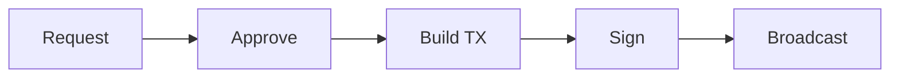
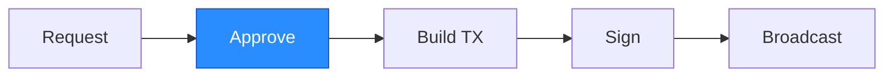
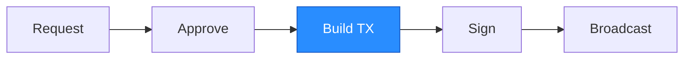
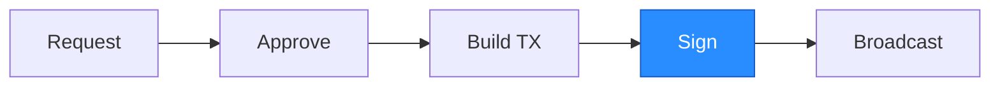

A withdrawal allows a user to redeem their `hBTC` on Sui for native BTC,
sent to a user-specified address on Bitcoin. The process has four phases:



## Request


A user submits an on-chain Sui transaction to request a withdrawal by calling
`hashi::withdraw::request_withdrawal`:

```move
public fun request_withdrawal(
    hashi: &mut Hashi,
    clock: &Clock,
    btc: Coin<BTC>,
    bitcoin_address: vector<u8>,
    ctx: &mut TxContext,
)
```

- `btc`: the `hBTC` to withdraw. Must be at least the
  [`bitcoin_withdrawal_minimum`](/config#bitcoin_withdrawal_minimum).
- `bitcoin_address`: the destination witness program, either `P2WPKH` (20
  bytes) or `P2TR` (32 bytes).

The protocol enforces a minimum withdrawal amount to guarantee that every
request can produce a valid Bitcoin transaction even under worst-case fee
conditions. This minimum covers the flat protocol fee, the worst-case miner
fee (which pays for both the user's transaction weight and opportunistic UTXO
pool consolidation), and the dust threshold for the user's output. See
[Fees](/fees) for the full breakdown.

The full `hBTC` amount is stored with the request and placed in a queue with a
timestamp. The user can cancel their request at any point before it has been
approved, subject to a cooldown period
([`withdrawal_cancellation_cooldown_ms`](/config#withdrawal_cancellation_cooldown_ms)).

## Approve



Before a queued request can advance, the Guardian's token-bucket rate limiter
must have sufficient capacity. If the request would exceed the current limit it
remains in the queue until capacity is replenished. Requests are generally
processed in FIFO order, but this is not a strict requirement.

Each committee member independently screens the destination address against
its configured sanctions-checking endpoint (see
[Handling Sanctioned Addresses](/sanctions)). A member that considers
the address sanctioned does not vote to approve the request. If a quorum
still approves, all members must assist in completing the withdrawal.

Committee members communicate with each other to collect signatures to approve
the request. After a quorum is reached, one member submits the certificate
onchain by calling `hashi::withdraw::approve_request`:

```move
entry fun approve_request(
    hashi: &mut Hashi,
    request_id: address,
    epoch: u64,
    signature: vector<u8>,
    signers_bitmap: vector<u8>,
    ctx: &mut TxContext,
)
```

The function verifies the committee certificate and marks the request as
approved, allowing it to be picked up for transaction construction.

## Build TX



The leader batches multiple approved requests into a single Bitcoin
transaction to amortize the fixed transaction overhead across users. The
leader waits for approved requests to buffer up before constructing a
transaction, until either a request has been waiting for roughly 10 minutes,
or a threshold number of approved requests have accumulated, whichever comes
first. This balances latency for individual users against efficiency for the
protocol.

The leader then constructs an unsigned Bitcoin transaction:

1. **Coin selection**: select UTXOs from the pool to cover the total
   withdrawal amount (miner fees are taken from the user's withdrawn amount).
   The coin selector might include extra inputs to opportunistically
   consolidate small UTXOs (see [Fees](/fees)).
2. **Outputs**: one output per withdrawal request to each user's destination
   address, plus one change output back to a Hashi-controlled address.
3. **Fee calculation**: the miner fee is estimated through `estimatesmartfee`,
   capped at a high fee rate threshold. Each user's share of the miner fee
   is deducted from their output. Validators independently verify that the
   fee is within acceptable bounds (at least `1 sat/vB`, at most 3x their
   own estimate).

The resulting unsigned transaction and its txid are committed onchain by
calling `hashi::withdraw::commit_withdrawal_tx`:

```move
entry fun commit_withdrawal_tx(
    hashi: &mut Hashi,
    request_ids: vector<address>,
    selected_utxos: vector<vector<u8>>,
    outputs: vector<vector<u8>>,
    txid: address,
    epoch: u64,
    signature: vector<u8>,
    signers_bitmap: vector<u8>,
    clock: &Clock,
    r: &Random,
    ctx: &mut TxContext,
)
```

The function verifies the committee certificate, burns the `hBTC` from each
request, spends the selected UTXOs from the pool, and creates a pending
withdrawal record that all validators can independently verify.

## Sign



Signing is a two-step process matching the 2-of-2 Taproot script (see
[Bitcoin Address Scheme](/address-scheme)):

1. **Guardian signature**: the unsigned transaction and metadata are sent to
   the Guardian enclave, which independently validates the request and
   produces a Schnorr signature for each input.
2. **MPC signature**: the committee runs the threshold Schnorr signing
   protocol (see [MPC Protocol](/mpc-protocol)) to produce the second
   signature for each input.

Both signatures are combined into the taproot script-path witness for each
input.

:::info

On `devnet`, no guardian is configured. Only the MPC signature is used.

:::

The signed transaction is committed onchain by calling
`hashi::withdraw::sign_withdrawal`:

```move
entry fun sign_withdrawal(
    hashi: &mut Hashi,
    withdrawal_id: address,
    request_ids: vector<address>,
    signatures: vector<vector<u8>>,
    epoch: u64,
    signature: vector<u8>,
    signers_bitmap: vector<u8>,
    ctx: &mut TxContext,
)
```

The function verifies the committee certificate and attaches the Schnorr
signatures to the pending withdrawal.

## Broadcast


The fully signed transaction is broadcast to the Bitcoin network. The
committee monitors the transaction until it reaches the configured number of
block confirmations (see
[`bitcoin_confirmation_threshold`](/config#bitcoin_confirmation_threshold)).
Once confirmed, a committee member calls
`hashi::withdraw::confirm_withdrawal`:

```move
entry fun confirm_withdrawal(
    hashi: &mut Hashi,
    withdrawal_id: address,
    epoch: u64,
    signature: vector<u8>,
    signers_bitmap: vector<u8>,
    ctx: &mut TxContext,
)
```

The function verifies the committee certificate and removes the pending
withdrawal, returning the spent UTXOs' change output to the pool.

If a transaction gets stuck, fee bumping is handled through CPFP. Either the
withdrawal recipient spends their output with a high-fee child, or Hashi
spends the change UTXO (see [Fees: stuck transactions](/fees#stuck-transactions)).
