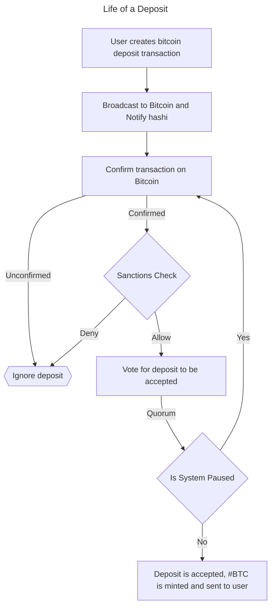

# Deposit

```mermaid
---
title: Life of a Deposit
---
flowchart TD
    A[User creates bitcoin deposit transaction]
    C[Broadcast to Bitcoin and Notify hashi]
    B[Confirm transaction on Bitcoin]
    S{Sanctions Check}
    D@{ shape: hex, label: "Ignore deposit" }
    E[Vote for deposit to be accepted]
    F[Deposit is accepted, #BTC is minted and sent to user]
    Paused{Is System Paused}

    A --> C
    C --> B
    B -- Confirmed --> S
    B -- Unconfirmed --> D
    S -- Allow --> E
    S -- Deny  --> D
    E -- Quorum --> Paused
    Paused -- Yes --> B
    Paused -- No --> F
```

<!-- TODO(andrew) Add more details for how we communicate with a bitcoin node. -->
