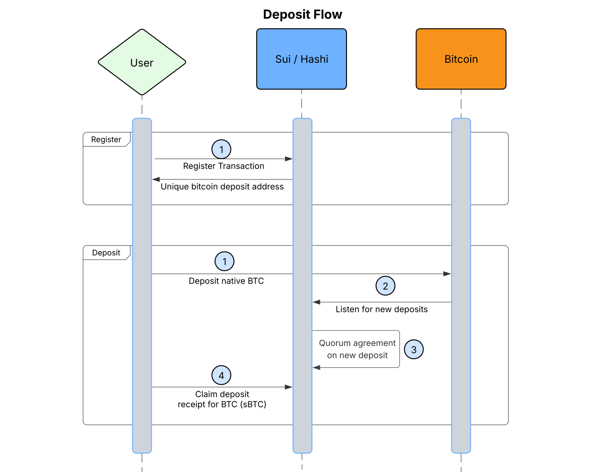
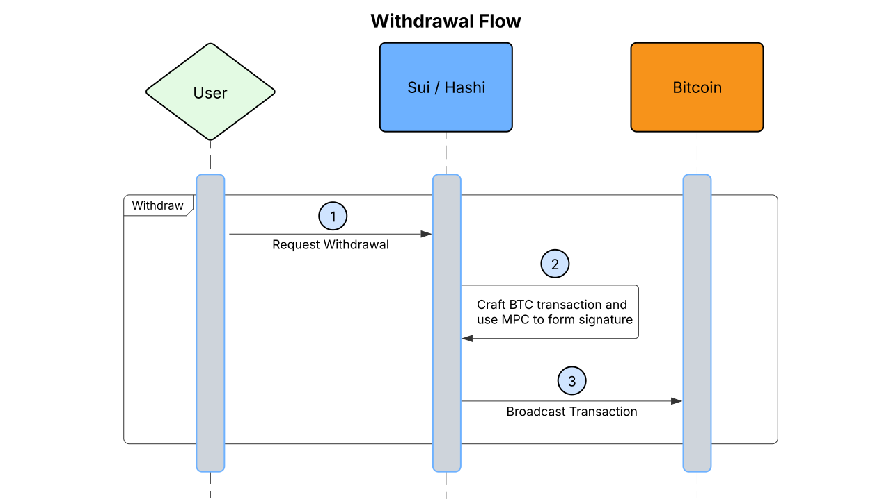

<!-- Lucid diagrams can be found here: https://lucid.app/lucidchart/d1fecc0c-0fd8-4de1-9633-499daa7909e8/edit?viewport_loc=-713%2C117%2C3668%2C1831%2C0_0&invitationId=inv_aae7f517-7b2c-45ba-ae56-c0d4f2e7228d -->

# User Flows

There are two main user flows for interacting with `hashi`, deposits and
withdrawals.

## Deposit Flow

In order for a user to leverage their BTC on Sui (e.g. as collateral for a
loan), they'll need to deposit the BTC they want to leverage to a hashi mpc
controlled bitcoin address.

### Register

This step only needs to be performed once per Sui Address.

Before a user can deposit funds, they'll need to register their Sui Address
with `hashi` in order to generate a unique Bitcoin deposit address. The
generated bitcoin deposit address is a hashi MPC controlled address and any and
all deposits sent to this deposit address will only be claimable by the linked
Sui Address.

1. User sends a transaction to Sui in order to generate a Bitcoin deposit
   address and link it with their Sui Address.
2. Hashi listens for new registrations to be able to monitor the newly
   generated Bitcoin address for deposits.

### Deposit

Once a deposit address has been established, a user can initiate a deposit to
hashi.

1. Broadcast a Bitcoin transaction depositing BTC into previously setup deposit
   address.
2. Hashi listens for the deposit.
3. Once a quorum has confirmed the deposit (after X block confirmations) the
   committee registers the new deposit on Sui, minting the equivalent amount of
   sBTC.
4. The user, using their linked Sui address, sends a transaction to claim the
   sBTC. This claim transaction could also be bundled with an interaction with
   a defi protocol to, for example, immediately leverage the sBTC as collateral
   for a loan in USDC.

## Withdrawal Flow

Once a user has decided they want their BTC back on bitcoin (e.g. they've paid
off their loan) they can initiate a withdrawal.

### Withdraw

1. User sends a transaction to Sui with the amount of sBTC they would like to
   withdraw and the Bitcoin address they want to withdraw to.
2. Hashi will pick up the withdrawal request and will craft a bitcoin
   transaction that sends the requested BTC (minus fees) to the provided
   Bitcoin address and uses MPC to sign the transaction.
3. The transaction is broadcast to the Bitcoin network.
