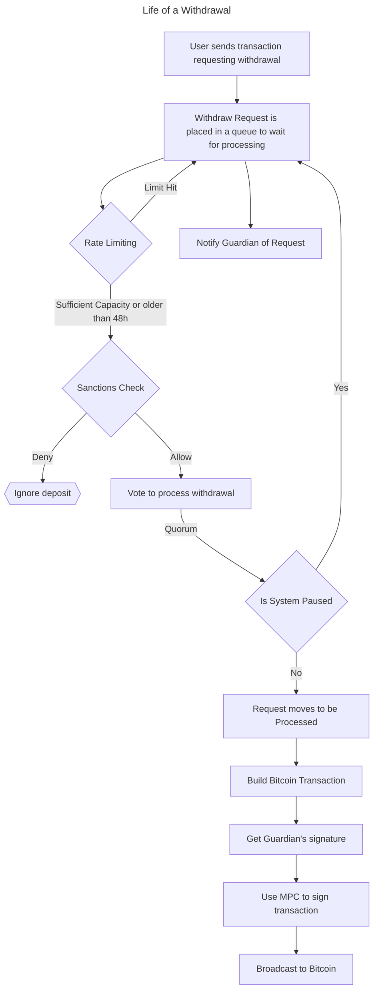

# Withdraw

```mermaid
---
title: Life of a Withdrawal
---
flowchart TD
    A[User sends transaction requesting withdrawal]
    RQ[Withdraw Request is placed in a queue to wait for processing]
    Limiter{Rate Limiting}
    S{Sanctions Check}
    D@{ shape: hex, label: "Ignore deposit" }
    E[Vote to process withdrawal]
    F[Request moves to be Processed]
    G[Build Bitcoin Transaction]
    H[Get Guardian's signature]
    I[Use MPC to sign transaction]
    J[Broadcast to Bitcoin]
    Paused{Is System Paused}
    NG[Notify Guardian of Request]

    A --> RQ
    RQ --> Limiter
    Limiter -- Limit Hit --> RQ 
    Limiter -- Sufficient Capacity or older than 48h --> S
    S -- Allow --> E
    S -- Deny  --> D
    E -- Quorum --> Paused
    Paused -- Yes --> RQ
    Paused -- No --> F
    F --> G
    G --> H
    H --> I
    I --> J
    RQ --> NG
```
