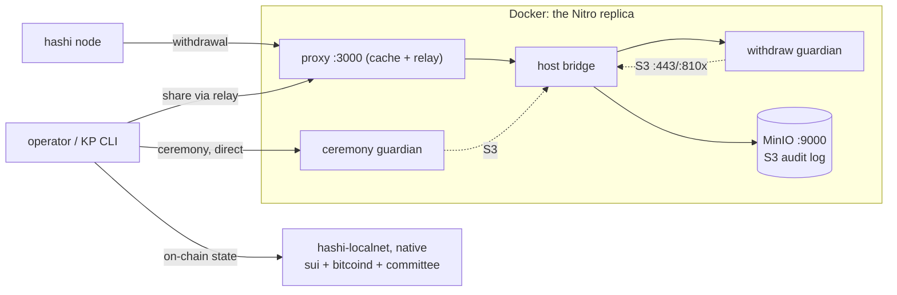

# hashi-guardian-local

A Mac-local replica of the guardian's AWS Nitro topology (each `vsock` hop becomes
a TCP hop between containers), wired to a native `hashi-localnet` for the on-chain
side, so the full ceremony → provision → withdrawal flow runs locally — no devnet.
The guardian runs `--features non-enclave-dev` (mock attestation), so this
exercises the real ceremony/relay/provision/activation path, not PCR attestation.



| Replica service | Stands in for | Production source |
| --- | --- | --- |
| `proxy` | the out-of-enclave proxy + relay | `crates/hashi-guardian-proxy` |
| `host` | the EC2 parent host's bridges | `docker/hashi-guardian/scripts/{expose_enclave,user-data}.sh` |
| `enclave` + `run.local.sh` | the withdraw-mode Nitro enclave | `docker/hashi-guardian/run.sh` |
| `ceremony` | the one-time ceremony-mode guardian | a runner-local ceremony container (deploy) |
| `minio` + `bucket-init` | the S3 Object-Lock audit bucket | the guardian's real S3 bucket |
| `init` | the operator + KP running the CLI | `hashi-guardian-init operator/key-provisioner …` |
| native `hashi-localnet` | devnet (sui + committee + published guardian key) | `crates/e2e-tests` |

## Run it

Needs Docker, plus `sui` and `bitcoind` on `PATH`.

```sh
make up            # MinIO + withdraw guardian + proxy
make ceremony      # KP roster + genesis ceremony: mints the BTC key, prints its pubkey
make localnet-cmd  # prints the `hashi-localnet start …` to run NATIVELY (separate terminal)
make provision     # operator provision, KP provision × threshold, then operator activate
make smoke         # confirm the guardian is activated
make down          # tear everything down
```

The relay rejects share submissions from unrostered signers; its roster is the
recipient set of the ceremony's share log, read straight from MinIO — no config
handoff, exactly as the deploy's proxy reads it from S3.

Once activated, the deposit/withdraw CLI flows work against the local network,
co-signed by the containerized guardian.

## Verify

The activated guardian's `enclaveBtcPubkey` should equal the ceremony pubkey — the
key was split into shares, reconstructed inside the enclave via the relay, and
then activated by the operator:

```sh
make pubkey   # the ceremony BTC master pubkey
docker compose --profile init run --rm -T init -c \
  'hashi-guardian-init tools fetch-info --endpoint http://host:3000 --field enclave-btc-pubkey'
```
