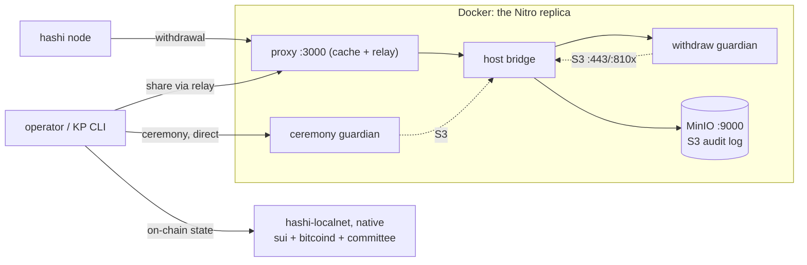

# hashi-guardian-local

A self-contained, Mac-friendly replica of the guardian's **AWS Nitro Enclave
topology**, wired to a native `hashi-localnet` so the whole ceremony → provision →
withdrawal flow runs locally — no devnet. Each `vsock` hop becomes a TCP hop
between containers; the on-chain half (`sui` + `bitcoind` regtest + a real
committee) comes from `hashi-localnet`, which the new
`--guardian-url/--guardian-btc-pubkey` flags make publish *this* guardian's
ceremony key instead of a throwaway one (see `crates/e2e-tests`).



The pieces map 1:1 to production:

| Replica service | Stands in for | Production source |
| --- | --- | --- |
| `proxy` | the out-of-enclave proxy + relay | `crates/hashi-guardian-proxy` |
| `host` | the EC2 parent host's bridges | `docker/hashi-guardian/scripts/{expose_enclave,user-data}.sh` |
| `enclave` + `run.local.sh` | the withdraw-mode Nitro enclave | `docker/hashi-guardian/run.sh` |
| `ceremony` | the one-time ceremony-mode guardian | a runner-local ceremony container (deploy) |
| `minio` + `bucket-init` | the S3 Object-Lock audit bucket | the guardian's real S3 bucket |
| `init` | the operator + KP running the CLI | `hashi-guardian-init operator/key-provisioner …` |
| native `hashi-localnet` | devnet (sui + committee + published guardian key) | `crates/e2e-tests` |

## Prerequisites

- Docker (guardian containers + MinIO).
- `sui` and `bitcoind` on `PATH` (or `SUI_BINARY` / `BITCOIND_EXE`) — the binaries
  the integration tests use (`.github/scripts/install-sui.sh` for the sui version;
  Homebrew `bitcoind` works).

## Run it end-to-end

```sh
make up            # MinIO + withdraw guardian + proxy (no chain yet)
make ceremony      # KP roster + genesis ceremony: mints the BTC key, prints its pubkey
make localnet-cmd  # prints the `hashi-localnet start …` to run NATIVELY (separate terminal)
make provision     # operator provision, then key-provisioner provision × threshold via the relay
make smoke         # confirm the guardian is fully initialized
```

After `make provision` the deposit/withdraw CLI flows work against the local
network, co-signed by the real containerized guardian. `make down` stops everything
and drops the volumes.

## Verifying success

The provisioned guardian's `enclaveBtcPubkey` should equal the ceremony pubkey —
proof the key was split into shares and reconstructed inside the enclave via the
relay's `ProvisionerInit`:

```sh
make pubkey   # the ceremony BTC master pubkey
docker compose --profile init run --rm -T init -c \
  'hashi-guardian-init tools fetch-info --endpoint http://host:3000 --field enclave-btc-pubkey'
```

## Expected noise (not errors)

- **`make provision` pauses ~60s at the first KP** ("guardian not heartbeating
  yet") — the withdraw guardian only heartbeats after `operator provision`, and the
  KP audit needs one beat (`HEARTBEAT_INTERVAL` = 1 min). The script waits it out.
- **Nodes log FATAL "refusing to seed local limiter" before provisioning** — the
  guardian isn't provisioned yet; it clears once `make provision` completes.
- **MinIO is on `19000/19001`** (console `minioadmin`/`minioadmin`), off `9000` so
  it doesn't collide with the localnet's sui fullnode.

## Re-running

`make down` drops all state (the bucket + KP roster), so the next run is a clean
`up → ceremony → localnet → provision` with a fresh pubkey. To re-provision a
guardian that only restarted (S3 intact), wait out the ~10-min other-session quiet
period so `operator provision`'s single-live-session check passes.

## Fidelity limits

A Mac has no Nitro (no `/dev/nitro_enclaves`, `AF_VSOCK`, or NSM), so this replica:

- runs `--features non-enclave-dev`, which **stubs the NSM attestation** — so it is
  **not** a PCR/attestation test (that needs the real EIF in `docker/hashi-guardian/`);
  the git-revision + signature + state-hash checks still run.
- replaces every `vsock` hop with **TCP between containers** (faithful topology,
  different transport) and talks to MinIO over http.
- uses **software test PGP keys** for the KPs — the same `gpg --decrypt` path, no
  yubikey.

Only `proxy:3000` is published; the guardian is reachable only through the `host`
bridge (KP shares go via the proxy relay; ceremony + operator init go direct, since
init RPCs must never be cached). `run.local.sh` is the sole file that diverges from
production `run.sh` — `VSOCK-*` → `TCP-*`, plus honoring `CEREMONY_MODE`.
